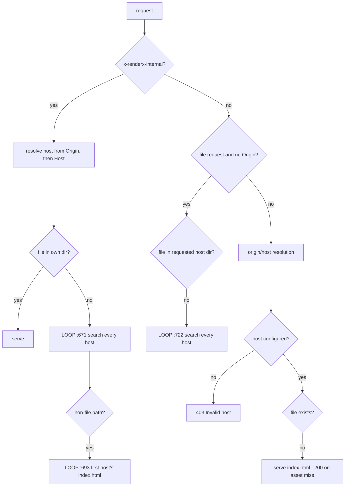
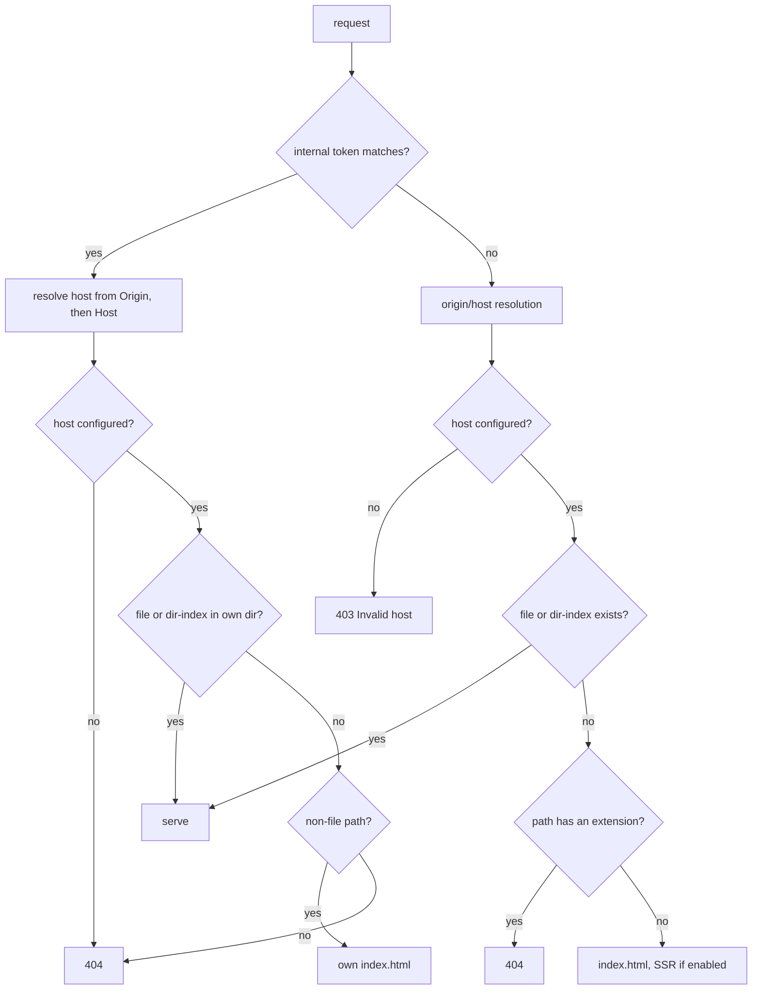

# RenderX — Remove Cross-Host File Fallback

## Overview

RenderX serves multiple tenants from one container, mapping `host` → `source` dir via `config.json`. Three fallback loops in `src/index.ts` search **every** configured host's directory when the requested host has no matching file. The result: any tenant's files are reachable from any other tenant's domain — and from a completely unknown `Host` header, bypassing the `403 Invalid host` policy the code already has.

Introduced by `171dce1`, which correctly named the old behaviour as a bug ("resolved against the first configured host that happened to have a matching file") and then kept that same search as step 2, justified as *"shared assets or unknown hosts"*. Neither justification survives inspection:

- **"shared assets"** — no shared-asset concept exists. `HostConfig` has no `common`, `fallback`, or `default` field, and the readme never mentions one. What ships is *collision*, resolved by `config.json` array order — reordering the array silently changes what an unrelated host serves.
- **"unknown hosts"** — there is already an explicit unknown-host policy at `src/index.ts:760` (`403 Invalid host`). All three loops run *before* it.

**Key finding that makes removal safe:** the loops are not load-bearing for SSR. `src/renderer.ts:194` sets `Origin: <real host>` on every intercepted sub-request, so on the legitimate render path `targetHostConfig` always resolves at `src/index.ts:640`. Loop `:693` is effectively dead code; loop `:671` fires only on a genuine miss — which should have been a 404 all along. Nothing depends on these loops.

Two defects ride along and are fixed here:

1. **Forgeable trust boundary.** `x-renderx-internal` is read raw off the request header (`src/index.ts:622`, `:202`) with no validation. Any client can set it and reach the *more* permissive of the two fallback paths (it resolves directories to their `index.html` too). Undocumented in readme and contributing — not public API.
2. **No miss path for assets.** A known host requesting a missing asset returns **200 with `index.html`**, never 404. Cause is the unconditional `return sendStaticFile(res, indexPath)` at the end of the SPA block — *not* SSR fall-through, since `shouldRender()` already returns `false` when `isDirectFile` is true (`src/index.ts:359`). Sharpest edge: the first host missing a `robots.txt` or `sitemap.xml` inherits another tenant's crawl directives.

## Impact Assessment

- **Scope**: Medium — `src/index.ts`, `src/config.ts`, `src/renderer.ts`, plus a new test dir
- **Risk**: Medium — behaviour-changing for any deployment relying on the fallback, in a repo with zero tests
- **Affected Areas**: request routing middleware, internal-render path, renderer header injection

**Assessment note.** Worth doing: `403 Invalid host` is a promise the code doesn't keep, and that grades the same regardless of who is hosting. Possible: yes, it is deletion plus one guard — no new abstractions. Affordable: it *reduces* code (one whole special-case branch disappears). Backward compatibility is the real cost — see Pre-flight. Blast radius on the public repo is bounded by the fact that nothing documented the fallback, so anyone depending on it is depending on array order, which is an accident rather than a contract. Flag-gating is strictly worse: it preserves the footgun, blesses it in config, and doubles the test matrix.

## Architecture

Current resolution, with the three loops marked:

Target resolution:

One host resolves to exactly one root. A miss is a miss.

## Dependencies

None. Tests use the built-in `node --test` runner (Node ≥18 is already the engine floor) — no new packages.

## Task Breakdown

Neil, 2026-09-04: **all of it ships as one patch, `1.1.1`.** The phases below are execution order, not separate releases — the header fix still lands before the loop deletion in the same branch, because it gates two of the three loops. Patch rather than minor because this restores the `403 Invalid host` behaviour the code already documents; the fallback was never documented, so no published contract changes. A patch also means anyone on `^1.1.0` picks the fix up without opting in.

### Phase 0 — Pre-flight (before any code)

Run 2026-09-04 against the source repos rather than the box — SSH was unavailable, and the deployed
builds come from these repos. Deployed config is `joahquin-infra/ec2/renderx/config.json`: six hosts,
in this order — `joahquin.com`, `zilliondines.com`, `handbook.zilliondines.com`, `neilveil.xyz`,
`postpress.blog`, `hellodb.io`.

- [x] Grep each host's `index.html` for bare-root asset refs and check them against that host's own `public/`
- [x] List every genuine dependency

**Findings — the fallback is serving the wrong host's files in production today:**

| Host | Requests | Currently gets | After |
| --- | --- | --- | --- |
| `neilveil.xyz` | `/favicon.svg` | **`postpress.blog`'s favicon** — it owns none | 404, browser default |
| `neilveil.xyz` | `/robots.txt` | **`joahquin.com`'s** — first host in the array with one | 404 (crawl all) |
| `postpress.blog` | `/robots.txt` | `joahquin.com`'s | 404 |
| `handbook.zilliondines.com` | `/robots.txt` | `joahquin.com`'s | 404 |
| `joahquin.com` | `/sitemap.xml` | **the handbook's sitemap** | 404 |
| `handbook.zilliondines.com` | `/handbook.html` | its own `index.html`, 200 | 404 |

Only `hellodb.io` owns its full set (`robots.txt`, `sitemap.xml`, `favicon.ico`). Every other host is
borrowing crawl directives from an unrelated site, which is the SEO failure this task exists to stop.

`/handbook.html` is a broken link inside the handbook's own `index.html` — the page is absent from its
VitePress build. The fallback has been masking it with a 200.

**Caveat:** this checked `index.html` references. Assets requested from inside JS bundles at runtime
are not covered, so watch the 404 rate after deploy.

- [ ] Site-side remediation — add `favicon.svg` to `neilveil.xyz/repos/web-app/public/`, and fix or remove the `/handbook.html` link in the handbook (see P2-3)

### Phase 1 — Collapse internal-render trust to one unforgeable signal

Done first in the branch: it gates two of the three loops.

The header mechanism is unchanged — the renderer still marks its own sub-requests with `X-RenderX-Internal`, and the server still reads it. Only the value changes, from the literal string `true` to a per-boot secret. This is what stops render recursion (Puppeteer fetches the page from this same server; without the marker the server would try to SSR it again, forever), so it cannot simply be removed.

- [x] `src/config.ts`: export `INTERNAL_RENDER_TOKEN = randomUUID()` — a per-boot secret, with a comment saying why
- [x] `src/renderer.ts:197`: send `headers['X-RenderX-Internal'] = INTERNAL_RENDER_TOKEN` instead of `'true'`
- [x] `src/index.ts:622` and `:202`: compare against `INTERNAL_RENDER_TOKEN` instead of `=== 'true'`
- [x] Delete `isRenderXRequest` entirely — the UA substring check at `src/index.ts:201` and `:621`, its `shouldRender()` parameter at `:354`/`:359`, and its use in the log-strategy branch at `:220`. It is a second, equally forgeable door to the same trust decision: `curl -H 'User-Agent: renderx'` skips SSR today. It is also fully redundant — `RENDERX_USER_AGENT` is set at `src/renderer.ts:200` in the same route interceptor that sets the header at `:197`, so every request carrying that UA already carries the token
- [x] Keep *sending* `RENDERX_USER_AGENT` outbound to the rendered page — it is a legitimate identifier. Stop trusting it inbound. That distinction is the fix
- [x] Verify SSR still renders end to end (a real page through the box, not a unit assertion), and that render recursion does not occur

Deliberately **not** a loopback check on `req.socket.remoteAddress` — that breaks the moment the reverse proxy is a separate container. A per-boot token carries no deployment assumption.

### Phase 2 — Delete the loops, add the miss path

- [x] Delete loop `src/index.ts:671` — cross-host file search in the internal branch
- [x] Delete loop `src/index.ts:693` — any-host `index.html` in the internal branch
- [x] Delete the **entire** `isFileRequest && !origin` block (`:706`–`:733`), not just its loop at `:722`. Step 1 of that block is a strict subset of the main path's "Check for direct file" — same host resolution, same `validatePath` — so removing it changes nothing for a known host and hands unknown hosts to the existing `403`. Confirm with the test matrix before deleting rather than after
- [x] Add an asset-miss guard immediately after "Check for direct file", before the SPA `index.html` fallback:
      `if (isFilePath(req.path)) return sendError(res, 404, 'Not found')`
- [x] Re-read the internal branch once the loops are gone and collapse any now-redundant nesting

### Phase 3 — Tests

The repo has no test suite. A behaviour-breaking release without one is how this regresses a third time (`171dce1` was round two).

- [x] `test/host-resolution.test.mjs` using `node --test`: boot `dist/index.js` on an ephemeral port with a fixture `config.json` (host A and host B, one file unique to each, one path present in B only)
- [x] Assert the matrix:

| `Host` | Path | Header | Expect |
| --- | --- | --- | --- |
| `a.test` | `/a-only.png` | — | 200, A's file |
| `a.test` | `/b-only.png` | — | **404** (was 200, B's file) |
| `a.test` | `/missing.png` | — | **404** (was 200, `index.html`) |
| `a.test` | `/robots.txt` (B only) | — | **404** (was 200, B's) |
| `a.test` | `/some/spa/route` | — | 200, A's `index.html` |
| `unknown.test` | `/` | — | 403 |
| `unknown.test` | `/b-only.png` | — | **403** (was 200, B's file) |
| `unknown.test` | `/b-only.png` | `X-RenderX-Internal: true` | **403** (was 200, B's file) |
| `a.test` | `/` | `Origin: http://a.test` | 200 |
| `unknown.test` | `/` | `Origin: http://unknown.test` | 403 |
| `a.test` | `/` | `User-Agent: renderx` | **200, SSR'd** (was 200, un-SSR'd shell) |

- [x] Add `"test": "node --test test/"` to `package.json` scripts
- [x] Wire into the existing GitHub Actions workflow so the release tag can't ship red

## Documentation

- [x] `readme.md`: state the resolution rule plainly — one host, one root; a miss is a 404; unknown host is 403. No cross-host search
- [x] Changelog entry for `1.1.1` naming the behaviour change explicitly (no changelog file exists yet — create one, or use the GitHub release body; pick one and be consistent)
- [x] Note in `contributing.md` that `x-renderx-internal` is an internal per-boot token, not a public header

## Explicitly out of scope

- **`"default": true` for unknown hosts** — rejected. 403 is the correct answer for a multi-tenant server. A default host means any domain anyone points at the box serves a real tenant: duplicate content, mirror-phishing, cert confusion. The bare-IP landing page case is already solved by configuring it as a host.
- **Per-host `404.html`** — no such support exists today; the fix does not need it. Ship the JSON 404 that every other `sendError` in the file already returns. Separate feature if ever wanted.
- **Declared shared assets (`common` source / per-host `fallback`)** — purely additive, and shipping new schema in the same release that removes behaviour makes the regression un-bisectable. Later, on demand. `cp favicon.png` in the build is cheaper than a config field.

## Doubts

### P1-1 · Whether 1.1.1 ships alone or bundled with the two other pending RenderX changes

**Context** — two RenderX task docs are already open on this board: `2026-08-26 feat--renderx-frame-headers.md` (which itself says "ship with the status-from-render change in one image tag") and `2026-09-02 chore--renderx-docker-release-ci.md`. This makes three pending changes to one image.
**Question** — does the loop removal go out in its own image tag, or ride along with the frame-headers work?
**Frame** — trade-off between deploy count and bisectability.
**Blocks** — nothing yet; decides the release tasks in Phase 2 and whether the frame-headers doc gets folded in. Deferring costs a possible re-cut of the tag.

a) Ship `1.1.1` alone — one behaviour change per tag, trivially bisectable if a site misbehaves; three deploys total
b) Bundle with frame-headers into one tag — one deploy, but two unrelated user-visible changes in one tag

**Recommend:** (a) — this is the only behaviour-changing one of the three, and it is the one most likely to need a rollback. Frame-headers is additive and can ride any later tag.
**If unanswered:** proceed with (a)

### P2-2 · How wide the asset-miss 404 guard should be

**Resolved:** (a), 404 on any extension — default fired unanswered, 2026-09-04. Shipped, then
confirmed safe: grepping every served site's router turned up no browser route containing a dot. The
only dotted paths found were `post-press`'s Typed Bridge RPC names (`/public.posts.list`), served by
`api.postpress.blog` — a different host — plus one docs-page prop. No allowlist needed.

### P2-3 · Whether the two site-side fixes land before the tag or after

**Context** — Phase 0 found two site-side issues the fallback was masking: `neilveil.xyz` owns no
`favicon.svg` and is being served Post Press's, and the handbook's `index.html` links to a
`/handbook.html` its build does not contain.
**Question** — fix those two sites first, or tag RenderX now and fix them after?
**Frame** — both are already wrong today; the fix only changes how the wrongness presents.
**Blocks** — nothing hard. Deferring means neilveil.xyz shows the browser's default favicon and the
handbook link returns a JSON 404 until those two sites redeploy.

a) Tag RenderX now, fix the sites after — two separate repos and deploys, neither change is urgent
b) Fix both sites first, then tag — nothing visibly regresses at any point

**Recommend:** (a) — neither is a regression. The favicon is currently *another product's logo* on a
personal site, and the handbook link is already broken. A default favicon and an honest 404 both beat
what ships today.
**If unanswered:** proceed with (a)
