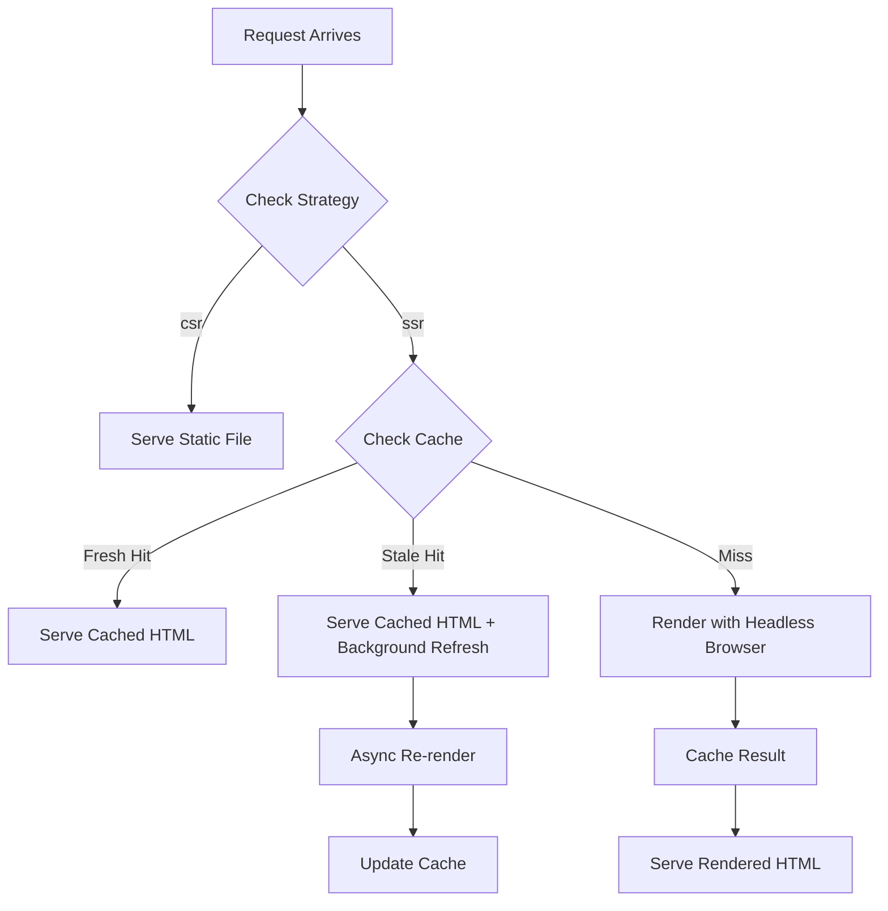

# RenderX v2 Simplification Plan

## Overview

Major simplification of RenderX: remove bot detection, remove `smart-ssr` strategy, consolidate `maxConcurrency` under `parallelRenders`, implement stale-while-revalidate caching, and clean up log labels. The result is a simpler config, fewer code paths, and better performance for high-traffic pages.

**Motivation:**

- Bot detection via user-agent is unreliable in the AI era — bots fake UAs, new ones appear constantly
- `maxConcurrency` and `parallelRenders` are the same thing — confusing duplication
- Current cache expires and forces cold renders — bad UX for high-traffic sites
- Log labels (`CSR`) don't reflect what's actually happening (serving static files)

## Impact Assessment

- **Scope**: Large
- **Risk**: Medium
- **Affected Areas**: `src/config.ts`, `src/cache.ts`, `src/renderer.ts`, `src/index.ts`, `config.ts`, `readme.md`, `contributing.md`

**Assessment**: Breaking changes to config (`smart-ssr` removed, `bots` removed, `maxConcurrency` removed), `/health` endpoint response shape, `/render` endpoint access (no longer bot-gated), and log output format. Backward compat handled by silently mapping `smart-ssr` → `ssr` with a deprecation log. Cache behavior change is transparent to consumers.

## Architecture

### After Simplification



### Config After Simplification

```typescript
type RenderingStrategy = 'ssr' | 'csr'

interface HostConfig {
    source: string
    host: string
    isActive?: boolean
    timeoutMs?: number
    parallelRenders?: number
    strategy?: RenderingStrategy
}

interface GlobalConfig {
    port?: number
    parallelRenders?: number
    cacheCleanupInterval?: number
    strategy?: RenderingStrategy
    hosts: HostConfig[]
    logs?: 'none' | 'ssr' | 'all'
    timeoutMs?: number
}
```

### Log Labels After Simplification

| Label | Meaning |
|---|---|
| `SSR` | Fresh render by headless browser (cache miss) |
| `SSR-CACHE` | Served from cache (fresh or stale) |
| `SSR-REFRESH` | Background re-render triggered (logged async) |
| `STATIC` | File served directly |

## Task Breakdown

### Phase 1: Remove `maxConcurrency`

> Low risk, no dependencies. Do first to clean up the codebase.

- [ ] Remove `maxConcurrency?: number` from `GlobalConfig` in `src/config.ts` (line 76)
- [ ] Remove `maxConcurrency` from config merge object in `loadConfig()` (line 112)
- [ ] In `getEffectiveConfig()`: rename output field to `parallelRenders`, simplify fallback to `host?.parallelRenders ?? global.parallelRenders ?? 10`
- [ ] Remove `maxConcurrency?: number` from root `config.ts` (line 22)
- [ ] Rename `maxConcurrency` to `parallelRenders` in `RenderConfig` interface in `src/renderer.ts` (line 10)
- [ ] Update concurrency check in renderer: `config.parallelRenders` (line 186–187)
- [ ] Rename `maxConcurrency` to `parallelRenders` in `/health` endpoint response in `src/index.ts` (lines 321, 328)
- [ ] Update both render call sites to pass `parallelRenders` in `src/index.ts` (lines 439, 754)
- [ ] Update `readme.md` — remove `maxConcurrency` from type definitions
- [ ] Update `contributing.md` — rename in health response example

### Phase 2: Remove bot detection & `smart-ssr`

> Removes the most code. Simplifies everything downstream.

#### 2.1: Config layer

- [ ] Remove `DEFAULT_BOTS` array from `src/config.ts` (lines 10–46)
- [ ] Remove `bots?: string[]` from `HostConfig` interface in `src/config.ts`
- [ ] Remove `bots: string[]` from `GlobalConfig` interface in `src/config.ts`
- [ ] Remove `bots` from config merge object in `loadConfig()`
- [ ] Remove `bots` from `getEffectiveConfig()` return
- [ ] Remove `botOnly` from `getEffectiveConfig()` return
- [ ] Remove `bots` from root `config.ts`
- [ ] Change `RenderingStrategy` type from `'smart-ssr' | 'ssr' | 'csr'` to `'ssr' | 'csr'`
- [ ] Change default strategy from `'smart-ssr'` to `'ssr'`
- [ ] Add backward compat: if config file contains `strategy: 'smart-ssr'`, map it to `'ssr'` and log deprecation warning on startup

#### 2.2: Request handling

- [ ] Remove `matchedBot` variable and bot-matching logic from logging middleware (lines 231–242)
- [ ] Remove `_matchedBot` flag on response object (line 267)
- [ ] Remove bot name from log display strategy (lines 292–296)
- [ ] Simplify strategy switch in logging middleware: remove `smart-ssr` case, `isBot` check (lines 248–260)
- [ ] Simplify `shouldRender()` function: remove `isBot` parameter, only check strategy (`ssr` → true, `csr` → false)
- [ ] Remove `isBot` detection in main route handler (lines 625–627)
- [ ] Remove `isBot` parameter from `shouldRender()` calls (lines 638, 681)
- [ ] Remove bot detection and `botOnly` gating in `/render` endpoint (lines 727–733) — endpoint stays open, protected by existing rate limiter

#### 2.3: Log labels

- [ ] In logging middleware: change strategy default from `'csr'` to `'static'`
- [ ] In strategy switch: change all `'csr'` assignments to `'static'` for non-rendered responses
- [ ] `displayStrategy = strategy.toUpperCase()` will now produce `STATIC` automatically
- [ ] Final labels: `SSR`, `SSR-CACHE`, `STATIC`

#### 2.4: Documentation

- [ ] Update `readme.md`: remove `smart-ssr` references, remove `bots` config docs, update type definitions, update request flow diagram, update log labels, document that `/render` endpoint is now open (rate-limited)
- [ ] Update `contributing.md`: remove bot-related references, update health response example
- [ ] Update root `config.ts`: remove `bots`, remove `smart-ssr`

### Phase 3: Stale-while-revalidate cache

> Depends on Phases 1–2 being done (cleaner `renderPage()` to work with).

#### 3.1: Extend cache metadata

- [ ] Add `createdAt: number` field to `CacheMetadata` interface in `src/cache.ts`
- [ ] In `cache.set`: write `createdAt: Date.now()` into metadata

#### 3.2: Update cache.get return type

- [ ] Define return type: `{ html: string; stale: boolean } | null`
- [ ] Update `CacheInterface.get` signature
- [ ] Accept `cacheTtl` as parameter to `cache.get` (needed to calculate stale threshold)

#### 3.3: Implement stale detection in cache.get

- [ ] Remove delete-on-read logic (current lines 164–171)
- [ ] Calculate age: `Date.now() - metadata.createdAt`
- [ ] If `age < cacheTtl * 1000 / 2` → return `{ html, stale: false }` (fresh)
- [ ] If `age >= cacheTtl * 1000 / 2` → return `{ html, stale: true }` (stale, needs refresh)
- [ ] If metadata is missing `createdAt` (old entries): derive from `expiresAt - cacheTtl`, or treat as stale

#### 3.4: Update cleanup to use 2x TTL

- [ ] In `cache.cleanup`: only delete entries where `Date.now() - metadata.createdAt > 2 * cacheTtl * 1000`
- [ ] This means entries that haven't been refreshed for 2 full cycles get purged

#### 3.5: Background re-render on stale hit

- [ ] Create an in-memory `Set<string>` to track in-flight refresh keys (key = `${deviceType}:${url}`)
- [ ] Create helper function `triggerBackgroundRefresh(cacheKey: string, localUrl: string, origin: string | undefined, deviceType: string, config: EffectiveConfig)`:
    - Check if key already in refresh set → skip if yes
    - Check if at `parallelRenders` capacity → skip if yes
    - Add to refresh set
    - Fire async render → on success: `cache.set(...)`, on error: log warning
    - Remove from refresh set in `finally` block
    - Log `SSR-REFRESH` on trigger

#### 3.6: Update renderPage() function

- [ ] Destructure `cache.get` result as `{ html, stale } | null`
- [ ] If result exists and `stale === false`: serve HTML, mark as cache hit, return
- [ ] If result exists and `stale === true`: serve HTML, mark as cache hit, call `triggerBackgroundRefresh(...)`, return
- [ ] If result is `null`: render fresh, cache, serve (existing behavior)

#### 3.7: Update /render endpoint

- [ ] Same stale-while-revalidate logic as `renderPage()`
- [ ] Destructure `cache.get` result, handle stale flag
- [ ] Call `triggerBackgroundRefresh(...)` when stale
- [ ] Include `deviceType` in refresh key (since `/render` accepts `?device=`)

## Documentation

- [ ] Update `readme.md` — new config shape, new strategies, new log labels, new cache behavior, updated architecture diagram
- [ ] Update `contributing.md` — health endpoint response, remove bot references

## Questions & Doubts

1. **`/render` endpoint access after bot removal**
    - Option A — Keep open, protected only by existing rate limiter (100 req/15min)
    - Option B — Add API key auth
    - Recommendation: Option A — the rate limiter is already in place, and the endpoint is useful for manual/programmatic pre-rendering. Can add auth later if abused.

2. **Backward compat for `smart-ssr` in existing configs**
    - Option A — Silently map `smart-ssr` → `ssr`, log deprecation warning on startup
    - Option B — Hard error if `smart-ssr` found
    - Recommendation: Option A — don't break existing deployments. Warning gives users time to update.

3. **`startCleanupInterval` parameter change**
    - Currently `startCleanupInterval` receives `intervalMinutes`. With 2x TTL cleanup, it needs `cacheTtl` to know the threshold.
    - Recommendation: Pass `cacheTtl` (in seconds) as a second parameter to `startCleanupInterval`, or have cleanup read it from global config directly.
