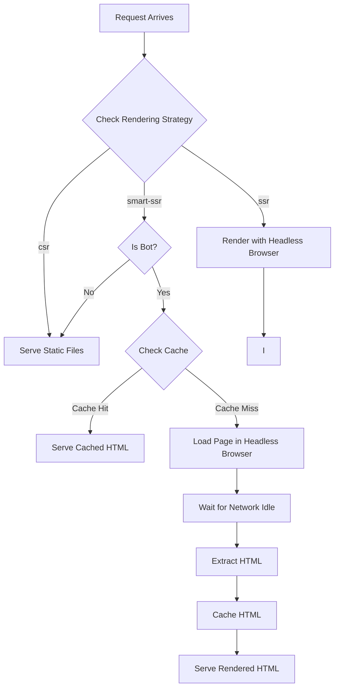

# RenderX

**On-the-fly HTML Prerender Service**

Created by [@neilveil](https://github.com/neilveil)

RenderX makes your React/Vite/SPA applications SEO-friendly by automatically rendering pages for search engines and bots. Regular users get fast static files, while bots get fully rendered HTML.

## What It Does

Modern single-page applications (SPAs) load content with JavaScript. Search engines and social media bots often see empty pages, hurting SEO and link previews.

RenderX solves this by:

-   Detecting bots automatically
-   Rendering pages using a headless browser
-   Caching results for speed
-   Serving static files to regular users (fast)

## Quick Setup

### Prerequisites

-   Docker

### Configuration

1. **Create config file** (`config.json`):

Create a `config.json` file. Most fields are optional and will use defaults if not specified. Minimal example:

```json
{
    "hosts": [
        {
            "source": "my-app",
            "host": "my-app.com"
        }
    ]
}
```

**Glob Pattern Examples:**

You can use glob patterns with `*` wildcards in the `host` field:

```json
{
    "hosts": [
        {
            "source": "my-app",
            "host": "*.my-app.com"
        },
        {
            "source": "catch-all",
            "host": "*"
        }
    ]
}
```

-   `*.my-app.com` matches all subdomains like `app.my-app.com`, `api.my-app.com`, `www.my-app.com`
-   `*` matches all domains (useful for catch-all configurations)
-   Exact matches (e.g., `my-app.com`) take priority over glob patterns

**Note:** The `source` field specifies the folder name within the global `hosts/` directory that contains your SPA build files. For example, if `source` is `"my-app"`, RenderX will look for your application files in `hosts/my-app/`.

Type definitions:

```typescript
type RenderingStrategy = 'smart-ssr' | 'ssr' | 'csr'

interface HostConfig {
    source: string
    host: string
    isActive?: boolean
    timeoutMs?: number
    parallelRenders?: number
    bots?: string[]
    strategy?: RenderingStrategy
}

interface GlobalConfig {
    port?: number
    parallelRenders?: number
    bots?: string[]
    cacheCleanupInterval?: number
    strategy?: RenderingStrategy
    hosts?: HostConfig[]
    logs?: 'none' | 'ssr' | 'all'
    timeoutMs?: number
    maxConcurrency?: number
}
```

2. **Add your app**:

```bash
mkdir -p hosts/my-app
# Copy your built SPA files to hosts/my-app/
```

### Run with Docker

RenderX is distributed as a Docker image and runs exclusively in Docker containers.

**Basic Usage:**

Pull the Docker image:

```bash
docker pull neilveil/renderx
```

Run the container:

```bash
docker run -p 8080:8080 \
  -v $(pwd)/hosts:/app/hosts \
  -v $(pwd)/config.json:/app/config.json \
  neilveil/renderx
```

**Testing:**

Test as a regular user (should serve static files):

```bash
curl http://localhost:8080 -H "Origin: https://my-app.com" > csr.html
```

Test as a bot (should render HTML):

```bash
curl http://localhost:8080 -H "Origin: https://my-app.com" -H "User-Agent: Googlebot" > ssr.html
```

**How it works:**

-   `-p 8080:8080`: Maps port 8080 on your host machine to port 8080 inside the container (where RenderX runs)
-   `-v $(pwd)/hosts:/app/hosts`: Mounts your local `hosts/` directory into the container so RenderX can access your SPA files
-   `-v $(pwd)/config.json:/app/config.json`: Mounts your configuration file into the container

**Port Configuration:**

-   **Direct port 80**: To use port 80 directly without a reverse proxy server, run Docker with `--cap-add=NET_BIND_SERVICE` and map port 80. The `--cap-add=NET_BIND_SERVICE` flag grants the container permission to bind to privileged ports (ports below 1024) without running as root, which is needed since RenderX runs as a non-root user for security. This allows RenderX to bind to port 80 and handle all incoming HTTP traffic directly.

    ```bash
    docker run --cap-add=NET_BIND_SERVICE -p 80:8080 \
      -v $(pwd)/hosts:/app/hosts \
      -v $(pwd)/config.json:/app/config.json \
      neilveil/renderx
    ```

-   **With reverse proxy**: If you're using a reverse proxy server (nginx, Apache, Caddy, Traefik, etc.), use `-p 8080:8080` (or any other port) and configure your reverse proxy to route traffic from port 80 to your chosen port where RenderX is listening.

**Volume Mounts:**

-   `hosts/`: Directory containing your SPA build files
-   `config.json`: Configuration file

Server runs on `http://localhost` (port 80)

## How It Works

1. **Bot Detection**: Checks if request is from a bot (Googlebot, etc.)
2. **Rendering**: If bot, renders page with headless browser and caches result
3. **Static Files**: If regular user, serves files directly (fast)
4. **Caching**: Rendered pages are cached for speed

### Request Flow



## Configuration Options

### Global Settings

All global settings are optional and will use defaults if not specified:

| Option                 | Type     | Required | Default       | Description                                                                                                                                                                                                                                                                                                                                                                                                                                                                                                                                                                         |
| ---------------------- | -------- | -------- | ------------- | ----------------------------------------------------------------------------------------------------------------------------------------------------------------------------------------------------------------------------------------------------------------------------------------------------------------------------------------------------------------------------------------------------------------------------------------------------------------------------------------------------------------------------------------------------------------------------------- |
| `port`                 | number   | No       | `8080`        | Server port inside container                                                                                                                                                                                                                                                                                                                                                                                                                                                                                                                                                        |
| `strategy`             | string   | No       | `"smart-ssr"` | Global rendering strategy (`smart-ssr`, `ssr`, or `csr`)                                                                                                                                                                                                                                                                                                                                                                                                                                                                                                                            |
| `parallelRenders`      | number   | No       | `10`          | Maximum number of parallel page renders                                                                                                                                                                                                                                                                                                                                                                                                                                                                                                                                             |
| `cacheCleanupInterval` | number   | No       | `60`          | Cache cleanup interval in minutes. This also determines how long cached entries are valid before expiration.                                                                                                                                                                                                                                                                                                                                                                                                                                                                        |
| `logs`                 | string   | No       | `"ssr"`       | Logging level: `"none"` (no request logs), `"ssr"` (only SSR and SSR-CACHE logs), `"all"` (all SSR and CSR logs)                                                                                                                                                                                                                                                                                                                                                                                                                                                                    |
| `bots`                 | string[] | No       | See below     | Array of bot user agent strings to detect. If not specified, defaults to:<br>- Search engines: `Googlebot`, `bingbot`, `Slurp`, `DuckDuckBot`, `Baiduspider`, `YandexBot`, `Applebot`<br>- Social media bots: `facebookexternalhit`, `Twitterbot`, `LinkedInBot`, `Pinterestbot`, `Slack`, `WhatsApp`, `TelegramBot`, `vkShare`<br>- AI bots: `GPTBot`, `ChatGPT-User`, `Google-Extended`, `ClaudeBot`, `Claude-Web`, `GrokBot`, `meta-externalagent`, `meta-externalfetcher`, `PerplexityBot`, `Amazonbot`, `CCBot`, `ia_archiver`, `YouBot`, `Neevabot`<br>- Other: `headlessbot` |
| `hosts`                | array    | Yes      | -             | Array of host configurations (see Host Settings below)                                                                                                                                                                                                                                                                                                                                                                                                                                                                                                                              |

### Host Settings

Each host configuration supports:

| Option            | Type     | Required | Default        | Description                                                                                                                                                                                                                                             |
| ----------------- | -------- | -------- | -------------- | ------------------------------------------------------------------------------------------------------------------------------------------------------------------------------------------------------------------------------------------------------- |
| `source`          | string   | Yes      | -              | The folder name within the global `hosts/` directory that contains your SPA build files. For example, if `source` is `"my-app"`, RenderX will look for files in `hosts/my-app/`.                                                                        |
| `host`            | string   | Yes      | -              | Your domain name (e.g., "my-app.com"). Supports glob patterns with `*` wildcard:<br>- `*` matches all domains<br>- `*.my-app.com` matches all subdomains (e.g., `app.my-app.com`, `api.my-app.com`)<br>- Exact matches take priority over glob patterns |
| `isActive`        | boolean  | No       | `true`         | Set to `true` to enable this host                                                                                                                                                                                                                       |
| `strategy`        | string   | No       | `"smart-ssr"`  | Rendering strategy for this host (`smart-ssr`, `ssr`, or `csr`). Note: `botOnly` is automatically determined by strategy (`smart-ssr` and `csr` only render for bots, `ssr` renders for all). Overrides global setting.                                 |
| `timeoutMs`       | number   | No       | `10000`        | Maximum time to wait for page load in milliseconds                                                                                                                                                                                                      |
| `parallelRenders` | number   | No       | `10`           | Maximum parallel renders for this host. Overrides global setting.                                                                                                                                                                                       |
| `bots`            | string[] | No       | Global default | Bot user agents specific to this host. Overrides global setting, uses global default if not specified.                                                                                                                                                  |

## Rendering Strategies

-   **`smart-ssr`** (recommended): Renders for bots only, static files for users
-   **`ssr`**: Always renders (slower, better SEO)
-   **`csr`**: Never renders (fastest, no SEO)

## Wait Strategy

RenderX always waits for network idle to ensure pages are fully loaded.

## License

MIT

---

Created by [@neilveil](https://github.com/neilveil)
