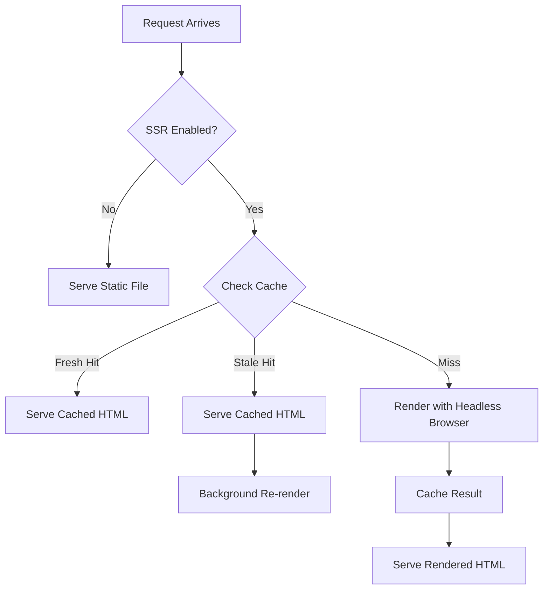

# RenderX

**On-the-fly HTML Prerender Service**

RenderX renders your SPA pages on-the-fly and caches the result. Every visitor gets fully rendered HTML, instantly.

## What It Does

Modern single-page applications (SPAs) load content with JavaScript. Search engines and social media bots often see empty pages, hurting SEO and link previews.

RenderX solves this by:

-   Rendering pages using a headless browser
-   Caching results for speed (stale-while-revalidate)
-   Refreshing cache in the background automatically
-   Queuing renders with priority to prevent overload
-   Serving static assets directly

## Quick Setup

### Prerequisites

-   Docker

### Configuration

1. **Create config file** (`config.json`):

Create a `config.json` file. Most fields are optional and will use defaults if not specified. Minimal example:

```json
{
    "hosts": [
        {
            "source": "my-app",
            "host": "my-app.com"
        }
    ]
}
```

SSR is enabled by default for all hosts. To disable SSR for a specific host (serve static files only):

```json
{
    "hosts": [
        {
            "source": "my-app",
            "host": "my-app.com"
        },
        {
            "source": "landing",
            "host": "landing.com",
            "ssr": false
        }
    ]
}
```

To disable SSR globally (e.g., while troubleshooting browser issues):

```json
{
    "ssr": false,
    "hosts": [
        {
            "source": "my-app",
            "host": "my-app.com"
        }
    ]
}
```

**Glob Pattern Examples:**

You can use glob patterns with `*` wildcards in the `host` field:

```json
{
    "hosts": [
        {
            "source": "my-app",
            "host": "*.my-app.com"
        },
        {
            "source": "catch-all",
            "host": "*"
        }
    ]
}
```

-   `*.my-app.com` matches all subdomains like `app.my-app.com`, `api.my-app.com`, `www.my-app.com`
-   `*` matches all domains (useful for catch-all configurations)
-   Exact matches (e.g., `my-app.com`) take priority over glob patterns

**Note:** The `source` field specifies the folder name within the global `hosts/` directory that contains your SPA build files. For example, if `source` is `"my-app"`, RenderX will look for your application files in `hosts/my-app/`.

Type definitions:

```typescript
interface HostConfig {
    source: string
    host: string
    isActive?: boolean
    timeoutMs?: number
    parallelRenders?: number
    ssr?: boolean
}

interface GlobalConfig {
    port?: number
    parallelRenders?: number
    cacheCleanupInterval?: number
    ssr?: boolean
    hosts?: HostConfig[]
    logs?: 'none' | 'ssr' | 'all'
    logFormat?: 'text' | 'json'
    timeoutMs?: number
}
```

2. **Add your app**:

```bash
mkdir -p hosts/my-app
# Copy your built SPA files to hosts/my-app/
```

### Run with Docker

RenderX is distributed as a Docker image and runs exclusively in Docker containers.

**Basic Usage:**

Pull the Docker image:

```bash
docker pull neilveil/renderx
```

Run the container:

```bash
docker run -p 8080:8080 \
  -v $(pwd)/hosts:/app/hosts \
  -v $(pwd)/config.json:/app/config.json \
  neilveil/renderx
```

**Testing:**

First request (renders page):

```bash
curl http://localhost:8080 -H "Origin: https://my-app.com"
```

Second request (served from cache, instant):

```bash
curl http://localhost:8080 -H "Origin: https://my-app.com"
```

**How it works:**

-   `-p 8080:8080`: Maps port 8080 on your host machine to port 8080 inside the container (where RenderX runs)
-   `-v $(pwd)/hosts:/app/hosts`: Mounts your local `hosts/` directory into the container so RenderX can access your SPA files
-   `-v $(pwd)/config.json:/app/config.json`: Mounts your configuration file into the container

**Port Configuration:**

-   **Direct port 80**: To use port 80 directly without a reverse proxy server, run Docker with `--cap-add=NET_BIND_SERVICE` and map port 80. The `--cap-add=NET_BIND_SERVICE` flag grants the container permission to bind to privileged ports (ports below 1024) without running as root, which is needed since RenderX runs as a non-root user for security. This allows RenderX to bind to port 80 and handle all incoming HTTP traffic directly.

```bash
docker run --cap-add=NET_BIND_SERVICE -p 80:8080 \
    -v $(pwd)/hosts:/app/hosts \
    -v $(pwd)/config.json:/app/config.json \
    neilveil/renderx
```

-   **With reverse proxy**: If you're using a reverse proxy server (nginx, Apache, Caddy, Traefik, etc.), use `-p 8080:8080` (or any other port) and configure your reverse proxy to route traffic from port 80 to your chosen port where RenderX is listening.

**Volume Mounts:**

-   `hosts/`: Directory containing your SPA build files
-   `config.json`: Configuration file

Server runs on `http://localhost` (port 80)

## How It Works

1. **Request arrives** with Origin header
2. **Host matching**: Find the matching host config
3. **SSR check**: If `ssr` is disabled, serve static files. Otherwise, check cache.
4. **Cache check**: Fresh hit serves instantly. Stale hit serves instantly and triggers a background re-render. Miss triggers a full render.

### Request Flow


```mermaid
flowchart TD
    A[Request Arrives] --> B{SSR Enabled?}
    B -->|No| C[Serve Static File]
    B -->|Yes| D{Check Cache}
    D -->|Fresh Hit| E[Serve Cached HTML]
    D -->|Stale Hit| F[Serve Cached HTML]
    F --> G[Background Re-render]
    D -->|Miss| H[Render with Headless Browser]
    H --> I[Cache Result]
    I --> J[Serve Rendered HTML]
```

## Configuration Options

### Global Settings

All global settings are optional and will use defaults if not specified:

| Option                 | Type    | Required | Default   | Description                                                                                                                                    |
| ---------------------- | ------- | -------- | --------- | ---------------------------------------------------------------------------------------------------------------------------------------------- |
| `port`                 | number  | No       | `8080`    | Server port inside container                                                                                                                   |
| `ssr`                  | boolean | No       | `true`    | Enable or disable SSR globally. Set to `false` to serve static files only (useful as a kill switch when SSR is failing).                        |
| `parallelRenders`      | number  | No       | `10`      | Maximum number of parallel page renders                                                                                                        |
| `cacheCleanupInterval` | number  | No       | `60`      | Cache cleanup interval in minutes. Also determines cache TTL: entries go stale after half this time, and are cleaned after 2x this time.        |
| `logs`                 | string  | No       | `"ssr"`   | Logging level: `"none"` (no request logs), `"ssr"` (SSR/SSR-CACHE/SSR-REFRESH logs only), `"all"` (all logs including STATIC)                  |
| `logFormat`            | string  | No       | `"json"`  | Log output format: `"text"` (human-readable with emojis) or `"json"` (structured for log aggregators). Defaults to `"text"` when `NODE_ENV=development`. |
| `hosts`                | array   | Yes      | -         | Array of host configurations (see Host Settings below)                                                                                         |

### Host Settings

Each host configuration supports:

| Option            | Type    | Required | Default  | Description                                                                                                                                                                                                                                             |
| ----------------- | ------- | -------- | -------- | ------------------------------------------------------------------------------------------------------------------------------------------------------------------------------------------------------------------------------------------------------- |
| `source`          | string  | Yes      | -        | The folder name within the global `hosts/` directory that contains your SPA build files. For example, if `source` is `"my-app"`, RenderX will look for files in `hosts/my-app/`.                                                                        |
| `host`            | string  | Yes      | -        | Your domain name (e.g., "my-app.com"). Supports glob patterns with `*` wildcard:<br>- `*` matches all domains<br>- `*.my-app.com` matches all subdomains (e.g., `app.my-app.com`, `api.my-app.com`)<br>- Exact matches take priority over glob patterns |
| `isActive`        | boolean | No       | `true`   | Set to `true` to enable this host                                                                                                                                                                                                                       |
| `ssr`             | boolean | No       | `true`   | Enable or disable SSR for this host. Overrides global setting. Set to `false` to serve static files only.                                                                                                                                               |
| `timeoutMs`       | number  | No       | `10000`  | Maximum time to wait for page load in milliseconds                                                                                                                                                                                                      |
| `parallelRenders` | number  | No       | `10`     | Maximum parallel renders for this host. Overrides global setting.                                                                                                                                                                                       |

### Environment Variables

| Variable           | Description                                | Default |
| ------------------ | ------------------------------------------ | ------- |
| `SSR`              | Enable/disable SSR (`true`/`false`)        | `true`  |
| `PORT`             | Server port                                | `8080`  |
| `PARALLEL_RENDERS` | Max parallel renders                       | `10`    |
| `LOG_FORMAT`       | Log format (`text`/`json`)                 | `json`  |
| `LOGS`             | Log level (`none`/`ssr`/`all`)             | `ssr`   |
| `TIMEOUT_MS`       | Render timeout in ms                       | `10000` |
| `NODE_ENV`         | Set to `development` for text log default  | -       |

## Caching

RenderX uses a stale-while-revalidate caching strategy:

-   **Fresh**: Cache entry younger than half the TTL (e.g., <30 min with 60 min cleanup interval). Served instantly.
-   **Stale**: Cache entry older than half the TTL but younger than 2x TTL. Served instantly, but a background re-render is triggered to refresh it.
-   **Expired**: Cache entry older than 2x TTL. Cleaned up automatically. Next request triggers a full render.

The `cacheCleanupInterval` config (in minutes) controls the TTL. Periodic cleanup runs at this interval, removing entries older than 2x TTL.

Cache can be invalidated via container restart or the `/cache/clear` endpoint.

## Logging

### Log Labels

| Label         | Meaning                                     |
| ------------- | ------------------------------------------- |
| `SSR`         | Fresh render by headless browser (cache miss) |
| `SSR-CACHE`   | Served from cache (fresh or stale)           |
| `SSR-REFRESH` | Background re-render triggered               |
| `STATIC`      | File served directly                         |

### Log Format

-   **`text`** (default in development): Human-readable with emojis and timestamps
-   **`json`** (default in production): Structured JSON with fields: `ts`, `method`, `host`, `path`, `status`, `strategy`, `duration`, `cache`

Set via `logFormat` in config or `LOG_FORMAT` environment variable.

### Log Levels

-   `"none"`: No request logs
-   `"ssr"`: Only SSR, SSR-CACHE, and SSR-REFRESH logs (default)
-   `"all"`: All logs including STATIC

## Render Queue

Requests are queued when the server is at render capacity (not rejected). Background stale-refreshes have lower priority than incoming real requests. If the queue overflows (3x `parallelRenders`), the server returns 503.

## Wait Strategy

RenderX always waits for network idle to ensure pages are fully loaded.

## License

MIT

---

Created by [@neilveil](https://github.com/neilveil)
